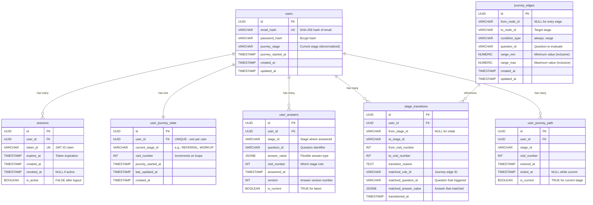

# Database Entity Relationship Diagram

This document provides a visual representation of the database schema for the Nvox Transplant Journey System.

## Entity Relationship Diagram



## Table Descriptions

### Core Tables

#### `users`
- **Purpose**: Stores user accounts with PII protection
- **Indexes**: `email_hash` (unique), `journey_stage`

#### `sessions`
- **Purpose**: JWT token management and logout functionality
- **Indexes**: `token_jti` (unique), `user_id`, `is_active`, `expires_at`

### Journey Routing Tables

#### `journey_edges`
- **Purpose**: Graph-based routing rules defining stage transitions
- **Indexes**: Composite on `(from_node_id, to_node_id)`, `from_node_id`, `to_node_id`
- **Design**:
  - Entry edge: `from_node_id = NULL → to_node_id = 'REFERRAL'` (condition_type: `always`)
  - Conditional edges: Use `range` type to evaluate numeric question answers
  - Managed via CSV → SQL migration workflow (see `ROUTING_RULES_GUIDE.md`)
- **Relationships**:
  - Referenced by `stage_transitions.matched_rule_id` (stores which edge was used)

### Journey Tracking Tables

#### `user_journey_state`
- **Purpose**: Tracks current journey state for each user (single source of truth)
- **Indexes**: `user_id` (unique), `current_stage_id`, `last_updated_at`

#### `user_answers`
- **Purpose**: Stores all user answers with full versioning and audit trail
- **Indexes**: Composite on `(user_id, stage_id)`, `(user_id, question_id)`, partial on `is_current`
- **Versioning**: Previous answers are kept with `is_current = FALSE` for audit

#### `stage_transitions`
- **Purpose**: Immutable audit trail of all stage changes
- **Indexes**: `user_id`, composite on `(user_id, transitioned_at)`, `from_stage_id`, `to_stage_id`
- **Immutability**: Never updated or deleted, provides complete audit trail

#### `user_journey_path`
- **Purpose**: Tracks detailed timeline of stage visits (entry/exit timestamps)
- **Indexes**: `user_id`, composite on `(user_id, entered_at)`, partial unique on `is_current`
- **Timeline**: Complete record of time spent in each stage

## Design Patterns

### 1. Graph-Based Routing Engine
- **Journey Edges Table**: Defines stage transitions as directed graph edges
- **Condition Types**:
  - `always`: Unconditional transition (entry edge)
  - `range`: Numeric range condition on question answers
- **Visit-Aware Algorithm**: Prioritizes revisit edges (loops) over forward edges
  - Ensures medical urgency (e.g., need more tests) takes precedence
  - Deterministic routing when multiple edges match
- **Runtime Loading**: Edges loaded from database at startup for performance
- **Management**: CSV → SQL migration workflow for non-technical rule editing
- **Audit Trail**: `stage_transitions.matched_rule_id` references the edge used

### 2. PII Protection
- Email addresses are hashed before storage (SHA-256)
- No reversible PII stored in database
- Anonymization support via hash replacement
- Password hashing with bcrypt (salt + cost factor)

### 3. Comprehensive Audit Trail
- `stage_transitions`: Immutable record of all stage changes with matched edge details
- `user_answers`: Full version history with timestamps (no deletions)
- `user_journey_path`: Complete timeline with entry/exit times
- Enables compliance, analytics, and debugging

### 4. Non-Linear Journey Support
- `visit_number`: Tracks returns to same stage (1st visit, 2nd visit, etc.)
- Version history allows comparing answers across visits
- Path tracking shows complete journey including loops and revisits
- Graph edges support any transition pattern (forward, backward, loops)

### 5. Denormalization for Performance
- `users.journey_stage`: Quick access without JOIN to `user_journey_state`
- `user_journey_state`: Single source of truth for current state
- Trade-off: Consistency managed via atomic transactions
- Caching strategy: Current state optimized for read-heavy workloads

### 6. Flexible Data Model
- JSONB columns for `answer_value` and `matched_answer_value`
- Supports evolving question types without schema migrations
- Enables complex answer formats (numbers, text, arrays, objects)
- Query flexibility: Can use JSONB operators for advanced filtering

## Constraints and Data Integrity

### Foreign Keys
- All journey tracking tables reference `users(id)` with `ON DELETE CASCADE`
- Session cleanup happens automatically when user is deleted
- Journey data is preserved for analytics until user deletion
- `journey_edges` has no foreign keys (independent graph definition)

### Check Constraints
- `visit_number > 0`: Ensures valid visit numbers
- `version > 0`: Ensures valid version numbers
- `exited_at >= entered_at`: Ensures valid time ranges in journey path
- `range_min <= range_max`: Ensures valid numeric ranges in journey edges

### Unique Constraints
- `users.email_hash`: One account per email
- `sessions.token_jti`: One session per token
- `user_journey_state.user_id`: One state per user
- `user_journey_path.user_id WHERE is_current = TRUE`: One current stage per user

### Data Integrity for Graph Routing
- **No Overlapping Ranges**: CSV validation script ensures no overlapping ranges for same (stage, question) pair
- **Valid Stage IDs**: Edge validation ensures all stage IDs reference valid stages in `journey_config.json`
- **Entry Edge**: Exactly one entry edge (from_node_id = NULL) ensures journey always starts at REFERRAL
- **Atomic Transitions**: All stage transitions use database transactions to ensure consistency

## Scalability Considerations

### Performance Optimizations
- **Indexes**: Comprehensive indexing for all common access patterns
- **Graph Loading**: `journey_edges` loaded at startup and cached in memory
- **Query Optimization**: Composite indexes on frequent JOIN columns
- **Connection Pooling**: Database connection pool for concurrent requests

### Long-Term Scalability
- **Partitioning**: `stage_transitions` can be partitioned by date (e.g., monthly) for large datasets
- **Archival**: Old journey data can be archived after completion (cold storage)
- **Caching**: Current state (`user_journey_state`) is optimized for Redis/Memcached caching
- **Read Replicas**: Journey history and analytics can use read replicas

### Routing Engine Scalability
- **Graph Size**: Current design supports hundreds of edges efficiently (in-memory loading)
- **Rule Complexity**: O(N) evaluation where N = number of outgoing edges from current stage (typically 2-5)
- **Hot Paths**: Most common transitions cached in application memory
- **Migration Workflow**: CSV → SQL migration allows rule updates without API restart (database reload)

---

## Graph-Based Routing Examples

### Example 1: Entry Edge (Unconditional)
```sql
-- Entry edge: All users start at REFERRAL stage
INSERT INTO journey_edges (from_node_id, to_node_id, condition_type, question_id, range_min, range_max)
VALUES (NULL, 'REFERRAL', 'always', NULL, NULL, NULL);
```

### Example 2: Conditional Transition (Range-Based)
```sql
-- If Karnofsky score is 0-39.999, transition from REFERRAL to EXIT
INSERT INTO journey_edges (from_node_id, to_node_id, condition_type, question_id, range_min, range_max)
VALUES ('REFERRAL', 'EXIT', 'range', 'ref_karnofsky', 0.0, 39.999);

-- If Karnofsky score is 40-100, transition from REFERRAL to WORKUP
INSERT INTO journey_edges (from_node_id, to_node_id, condition_type, question_id, range_min, range_max)
VALUES ('REFERRAL', 'WORKUP', 'range', 'ref_karnofsky', 40.0, 100.0);
```

### Example 3: Revisit Edge (Loop Back)
```sql
-- If board decides more tests needed, loop back to WORKUP
INSERT INTO journey_edges (from_node_id, to_node_id, condition_type, question_id, range_min, range_max)
VALUES ('BOARD', 'WORKUP', 'range', 'brd_needs_more_tests', 1.0, 1.0);
```

## Related Documentation

- **Routing Flow**: See `ROUTING_FLOW.md` for detailed routing algorithm
- **Rule Management**: See `ROUTING_RULES_GUIDE.md` for CSV → SQL migration workflow
- **Architecture**: See `ARCHITECTURE_DECISIONS.md` for system design rationale
- **Edge Descriptions**: See `config/edges-descriptions.md` for business logic documentation
- **Migrations**: See `migrations/004_add_journey_edges_table.sql` and `migrations/005_populate_journey_edges.sql`
